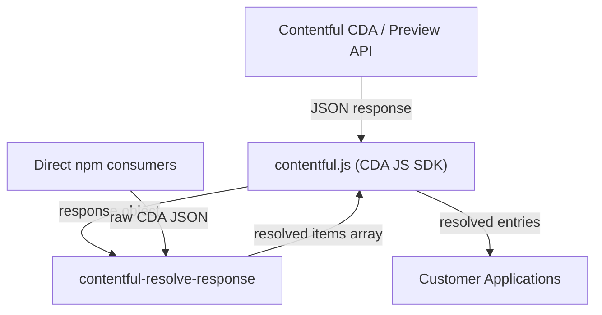

# Architecture

<!-- Generated by seed-golden-context | Last updated: 2026-05-07 -->

## Overview

`contentful-resolve-response` is a lightweight JavaScript library that transforms a raw Contentful Content Delivery API (CDA) response — containing flat `items` and `includes` arrays — into a fully resolved object graph where links are replaced with actual entity references. It is the canonical implementation of link resolution for the Contentful JavaScript SDK ecosystem.

## System Context

The library sits between the raw API response and the consumer. It is used internally by `contentful.js` and can also be consumed directly by developers who fetch CDA JSON via raw HTTP.

## Internal Structure

| Path | Purpose |
|---|---|
| `index.js` | Single-file implementation containing all resolution logic (link detection, entity map building, recursive walking, cleanup) |
| `dist/cjs/` | CommonJS build output (generated by Babel) |
| `dist/esm/` | ESM build output (generated by Babel) |
| `test/unit/` | Mocha + Chai unit tests with deep-freeze immutability assertions |
| `.babelrc` | Dual-target Babel config (CJS for Node >= 4.7.2, ESM for bundlers) |

## Data Flow

1. **Input** — A CDA-shaped response object: `{ items: [...], includes: { Entry: [...], Asset: [...] } }`
2. **Deep copy** — The response is deep-copied via `fast-copy` to avoid mutating the caller's input
3. **Indexing** — All entities from `items` and `includes` are indexed into a `Map` keyed by `{type}!{id}` (and optionally `{spaceId}!{environmentId}!{type}!{id}` for cross-space resolution)
4. **Recursive walking** — The library walks each item (or only specified `itemEntryPoints`), identifies `Link` and `ResourceLink` objects via `sys.type`, and replaces them with the corresponding entity from the index
5. **Cleanup** — If `removeUnresolved: true`, any links without a matching entity are removed from arrays and deleted from objects
6. **Output** — Returns the resolved `items` array with all links replaced by full entity references

## Domain Concepts

- **Link** — An object with `sys.type === "Link"` pointing to another entity by `linkType` + `id`
- **ResourceLink** — An object with `sys.type === "ResourceLink"` using URN-based addressing for cross-space references (format: `crn:contentful:::content:spaces/{spaceId}/environments/{envId}/entries/{entryId}`)
- **Entity Map** — Internal `Map` that indexes all available entities for O(1) lookup during resolution
- **UNRESOLVED_LINK** — A sentinel object (unique reference, not Symbol, to avoid polyfill bloat) used internally to mark links that cannot be resolved
- **itemEntryPoints** — An option to restrict link resolution to specific top-level keys (e.g., `['fields']`), leaving `sys` metadata intact

## Key Dependencies

| Dependency | Why it's here |
|---|---|
| `fast-copy` | Deep-clones the input response to guarantee immutability of the caller's data. Replaced lodash `cloneDeep` in 2020 for smaller bundle size. |

## Configuration

This library has no runtime configuration, environment variables, or feature flags. Behavior is controlled entirely via the `options` parameter passed to `resolveResponse()`:

| Option | Purpose | Default |
|---|---|---|
| `removeUnresolved` | Remove links that cannot be resolved from the output | `false` |
| `itemEntryPoints` | Restrict resolution to specific top-level keys of each item (e.g., `['fields']`) | `undefined` (resolve all keys) |

## Integration Points

### Upstream (this repo consumes)

- **Contentful CDA JSON shape** — The library assumes the standard `{ items, includes }` response structure from the Content Delivery API

### Downstream (consumes this repo)

- **contentful.js** — The official Contentful JavaScript SDK uses this as its link resolution engine
- **Direct npm consumers** — Developers using raw CDA HTTP responses who want graph resolution without the full SDK
